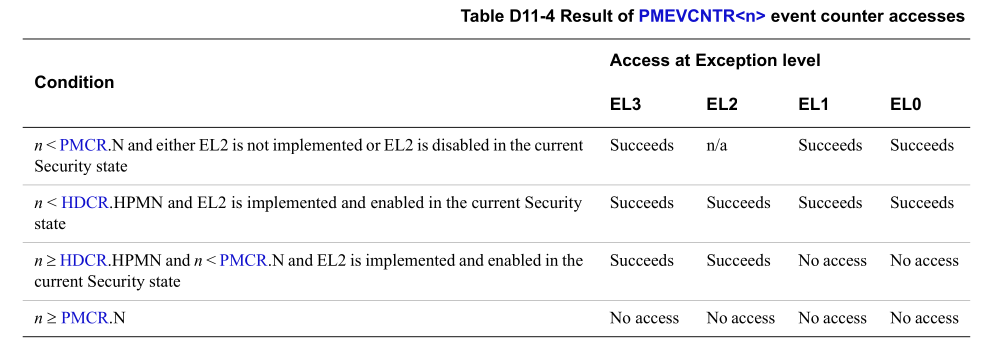

All implemented event counters are accessible in EL3 and EL2. If EL2 is
implemented the hypervisor uses HDCR.HPMN to reserve an event counter, with the
effect that if EL2 is enabled in the current Security state, software cannot
access that counter and its associated state from EL0 or EL1.

If FEAT_FGT is implemented, if PMSELR.SEL or n indicates an unimplemented event
counter, access to PMXEVTYPER, PMXEVCNTR, PMEVTYPER<n>, or PMEVCNTR<n> is
UNDEFINED.

> Note
> 
> Whether software can access an event counter at an Exception level does not
> affect whether the counter counts events at that Exception level. For more
> information, see Controlling the PMU counters on page D11-5254 and Enabling
> event counters on page D11-5254.

# D11.10.1 PMEVCNTR<n> event counters

Table D11-4 on page D11-5265 shows how the number of implemented event
counters, PMCR.N, and if EL2 is implemented, the value of the HDCR.HPMN field
affects the behavior of permitted accesses to the PMEVCNTR<n> event counter
registers for values of n from 0 to 30.

Where Table D11-4 on page D11-5265 shows access succeeds for an event counter
n, the access might be UNDEFINED or generate a trap exception. See the
descriptions of PMEVCNTR<n> and PMXEVCNTR for details. Where Table D11-4 on
page D11-5265 shows no access for an event counter n:

* When PMSELR.SEL is n, the PE prevents direct reads and direct writes of
  PMXEVTYPER or PMXEVCNTR. See the register descriptions for more
  information.
* The PE prevents direct reads and direct writes of PMEVTYPER<n> or
  PMEVCNTR<n>. See the register descriptions for more information.
* Direct reads and direct writes of the following registers are RAZ/WI.
  PMOVSCLR[n], PMOVSSET[n], PMCNTENSET[n], PMCNTENCLR[n], PMINTENSET[n], and
  PMINTENCLR[n].
* Direct writes to PMSWINC[n] are ignored.
* A direct write of 1 to PMCR.P does not reset PMEVCNTR<n>.

# D11.10.2  Cycle counter

The PMU does not provide any control that a hypervisor can use to reserve the
cycle counter for its own use. However, access to the PMU registers are subject
to the access permissions described in Configurable instruction controls on
page D1-4665.
