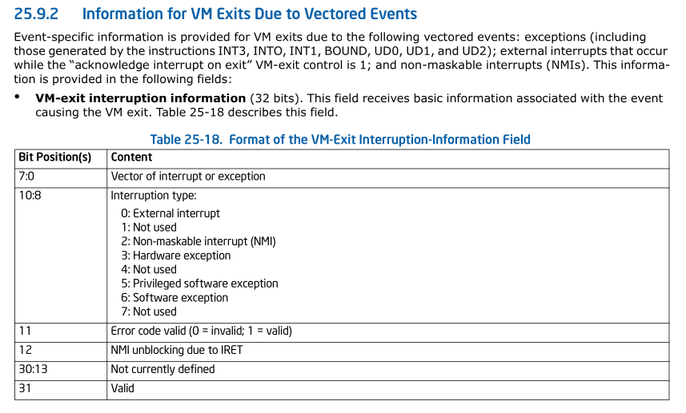

# 25.4.2 Guest Non-Register State

# 25.6.1 Pin-Based VM-Execution Controls
## NMI exiting

If this control is 1, non-maskable interrupts (NMIs) cause VM exits. Otherwise,
they are delivered normally using descriptor 2 of the IDT. This control also
determines interactions between IRET and blocking by NMI (see Section 26.3).

> 如果该control 为1, NMIs 将会导致 VM exits. 否则, 它将会使用 IDT 中的描述符 2
> 来正常delivery. 该control 还决定了 IRET 和 blocking by NMI的相互作用(请查看章节 
> 26.3)

## Virtual NMIs

If this control is 1, NMIs are never blocked and the “blocking by NMI” bit (bit
3) in the interruptibility-state field indicates “virtual-NMI blocking” (see
Table 25-3). This control also interacts with the “NMI-window exiting”
VM-execution control (see Section 25.6.2).

> 如果该控制字段为1, NMIs 将不在被blocked, 并且 "blocking by NMI"字段将指的是
> "virtual-NMI blocking" (请查看 Table 25-3). 该控制字段还和 "NMI-window exiting"
> VM-execution 控制字段相互作用 (请查看 Section 25.6.2)

# 25.6.2 Processor-Based VM-Execution Controls

## NMI-window exiting

If this control is 1, a VM exit occurs at the beginning of any instruction if
there is no virtual- NMI blocking (see Section 25.4.2).

> 如果该控制字段为1, 如果没有 virtual-NMI blocking, 将会在任意指令之前 触发一个 VM
> exit

# 26.3 CHANGES TO INSTRUCTION BEHAVIOR IN VMX NON-ROOT OPERATION
## IRET

Behavior of IRET with regard to NMI blocking (see Table 25-3) is determined by
the settings of the “NMI exiting” and “virtual NMIs” VM-execution controls:

> 关于 "NMI blocking" 的 IRET 的行为 由 "NMI exiting" 和 "virtual NMIs" 
> VM-execution 控制字段的设置确定: 

* If the “NMI exiting” VM-execution control is 0, IRET operates normally and
  unblocks NMIs. (If the “NMI exiting” VM-execution control is 0, the “virtual
  NMIs” control must be 0; see Section 27.2.1.1.)

  > 如果 "NMI exiting" VM-execution 控制字段为0, IRET 按照正常流程执行并且unblock
  > NMIs (如果 "NMI execution 控制字段为 0, "virtual NMI" 控制字段必须为0;请查看
  > Section 27.2.1.1).

* If the “NMI exiting” VM-execution control is 1, IRET does not affect blocking
  of NMIs. If, in addition, the “virtual NMIs” VM-execution control is 1, the
  logical processor tracks virtual-NMI blocking. In this case, IRET removes any
  virtual-NMI blocking. The unblocking of NMIs or virtual NMIs specified above
  occurs even if IRET causes a fault.
  > 如果 "NMI exiting" VM-execution控制字段为1. IRET 将不受 blocking of NMIs的影响.
  > 另外, 如果 "virtual NMIs" VM-execution 控制字段也为1, 逻辑处理器将跟踪 
  > virtual-NMI blocking. 在这种情况下, IRET 指令将移除任何 virtual-NMI blocking.
  > 即使在IRET 造成了一个fault, 上面所述的 NMIs 或者 virtual NMIs的unblocking 仍然
  > 会发生.

# 28.2.1 Basic VM-Exit Information

## Table 28-7. Exit Qualification for EPT Violations
Bit 12: NMI unblocking due to IRET (see Section 28.2.3).

# 28.2.2 Information for VM Exits Due to Vectored Events

# 28.2.3 Information About NMI Unblocking Due to IRET

A VM exit may occur during execution of the IRET instruction for reasons
including the following: faults, EPT violations, page-modification log-full
events, or SPP-related events.

> 可能在执行IRET 指令时由于如下原因导致 VM exit:
>  + faults
>  + EPT violations
>  + page-modification log-full event
>  + SPP-related event.

An execution of IRET that commences while non-maskable interrupts (NMIs) are
blocked will unblock NMIs even if a fault or VM exit occurs; the state saved by
such a VM exit will indicate that NMIs were not blocked.

> commences: 开始
>
> 当 NMI 被 block时, 开始执行 IRET IRET, 即使发生 fault 或者 VM exit; 也会造成 NMIs
> unblock;  由VM exit 保存该状态表明 NMIs将会在被blocked.

VM exits for the reasons enumerated above provide more information to software
by saving a bit called “NMI unblocking due to IRET.” This bit is defined if (1)
either the “NMI exiting” VM-execution control is 0 or the “virtual NMIs”
VM-execution control is 1; (2) the VM exit does not set the valid bit in the
IDT-vectoring information field (see Section 28.2.4); and (3) the VM exit is
not due to a double fault. In these cases, the bit is defined as follows:

> 由于上面列举的原因, VM exit 通过保存 一个 bit(被称为 "NMI unblocking due to IRET")
> 向software 提供给多信息. 这个bit在下面两种条件下可被定义:
>   + NMI exiting VM-execution control 为0 || virtual NMI VM-execution control 为 1
>   + VM exit 在 IDT-vectoring information 字段没有设置 valid bit (请查看 Section 28.2.4)
>     > NOTE
>     > 
>     > 因为是由于 event delivery导致, 所以肯定还没有执行IRET, 所以该字段无效.
>   + VM exit 将不会导致 double fault.
> 
> 在这些情况下, 该bit如下被定义

* The bit is 1 if the VM exit resulted from a memory access as part of
  execution of the IRET instruction and one of the following holds:
  > 如果VM exit 是由于 memroy access, 而该 memory access 是IRET instruction 
  > 执行的一部分, 并且下面其中之一满足:
  + The “virtual NMIs” VM-execution control is 0 and blocking by NMI (see Table
    25-3) was in effect before execution of IRET.
    > "virtual NMIs" VM-execution control = 0 并且 blocking by NMI 是effect在IRET
    > 执行之前

  + The “virtual NMIs” VM-execution control is 1 and virtual-NMI blocking was
    in effect before execution of IRET.
    > "virtual NMIs" VM-execution control 是1, 并且 virtual-NMI blocking 在执行
    > IRET之前是effect

* The bit is 0 for all other relevant VM exits.
  > relevant: 有关的;正确的;有价值的;有意义的
  >
  > 对于其他的 VM exits 该bit 为0

For VM exits due to faults, NMI unblocking due to IRET is saved in bit 12 of
the VM-exit interruption-information field (Section 28.2.2). For VM exits due
to EPT violations, page-modification log-full events, and SPP-related events,
NMI unblocking due to IRET is saved in bit 12 of the exit qualification
(Section 28.2.1).

> 对于由fault造成的VM exits, 由IRET造成的NMI unblocking 保存在 VM-exit interruption-
> information field (Section 28.2.2). 对于 EPT violations, page-modification log-full 
> event, SSP-related event 造成 VM exits,  由 IRET 造成的 NMI unblocking 保存在 exit 
> qualification 的bit 12 (Section 28.2.1)

(Executions of IRET may also incur VM exits due to APIC accesses and EPT
misconfigurations. These VM exits do not report information about NMI
unblocking due to IRET.)

> ( IRET 执行 可能也由于 APIC access 和 EPT misconfigurations 造成 VM exit. 这些 VM exits
> 不会报告和 NMI unblock due to IRET 相关的信息.)

