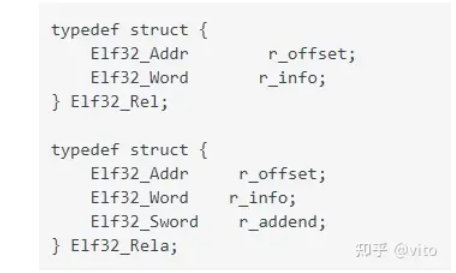

# relocate_kernel
```
__relocate_kernel:
        /*
        ¦* Iterate over each entry in the relocation table, and apply the
        ¦* relocations in place.
        ¦*/
        ldr     w9, =__rela_offset              // offset to reloc table
        ldr     w10, =__rela_size               // size of reloc table

        mov_q   x11, KIMAGE_VADDR               // default virtual offset
        add     x11, x11, x23                   // actual virtual offset
        add     x9, x9, x11                     // __va(.rela)
        add     x10, x9, x10                    // __va(.rela) + sizeof(.rela)

0:      cmp     x9, x10
        b.hs    1f
        ldp     x11, x12, [x9], #24
        ldr     x13, [x9, #-8]
        cmp     w12, #R_AARCH64_RELATIVE
        b.ne    0b
        add     x13, x13, x23                   // relocate
        str     x13, [x11, x23]
        b       0b
1:      ret
ENDPROC(__relocate_kernel)
```
我们先看下rela table entry




* r_offset: 给出需要重定位的位置
* r_info : 这里表明重定位的类型，kernel 只检测是否是
    `R_AARCH64_RELATIVE`类型，如果是, 才进行重定位
* r_addend: 相当于初始位置，是一个相对值, 该值 + x23 为需要重定位
 的虚拟地址（这块得还得看下kernel 这边是怎么做的)

代码逻辑也很简单:
* 计算rela的首地址
```
 __rela_offset   = ABSOLUTE(ADDR(.rela) - KIMAGE_VADDR)
__rela_size     = SIZEOF(.rela);
```
可以看到__rela_offset + KIMAGE_VADDR为编译地址，这里还需要+偏移也就是x23

* 依次读取每个entry, 将 r_offset --> x11, r_info--> 12,  r_addend --> x13
* r_addend(x13) + offset(x23)
* 将计算后的值，放入[r_offset + offset](也就是需要重定位的位置，这里也得加上offset,
 因为现在开启了分页，而且是按照 + offset 进行分页的所以，想要访问地址，都需要 +
 offset)


> NOTE
>
> 参考文档: https://zhuanlan.zhihu.com/p/628432429

# kaslr offset 取值
## kernel image offset
```cpp
u64 __init kaslr_early_init(u64 dt_phys)
{
        ...
        /*
        * OK, so we are proceeding with KASLR enabled. Calculate a suitable
        * kernel image offset from the seed. Let's place the kernel in the
        * middle half of the VMALLOC area (VA_BITS_MIN - 2), and stay clear of
        * the lower and upper quarters to avoid colliding with other
        * allocations.
        * Even if we could randomize at page granularity for 16k and 64k pages,
        * let's always round to 2 MB so we don't interfere with the ability to
        * map using contiguous PTEs
        */

        mask = ((1UL << (VA_BITS - 2)) - 1) & ~(SZ_2M - 1);
        offset = seed & mask;
        ...
}
```
这里使用`seed & mask`, seed是一个随机的64 bits, 所以只需要分析下mask,
看其对offset有一个怎样的限制。

上面有一些注释，我们简单概括下:
* 把 kernel img限制在一个范围之内, 这个位置尽量在vmalloc的中心位置
* offset进行一个对齐，这里肯定是考虑page_size的对齐，因为这部分是不能影响的，
  因为这是硬件上的限制，（[0, PAGE_SHIFT]该区间的bits用于在页表内的地址偏移，
  所以这部分不能做offset,否则寻址的时候，会出现问题）

那我们看下上面的计算，
```
vmalloc的大小是:
BIT(VA_BTS_MIN - 1)

因为seed是完全随机的，所以seed & mask为:
[0, BIT(VA_BITS_MIN -2)] , 占用 vmalloc size的比例为: [0, 1/2]

offset最后计算为 BIT(VA_BITS_MIN - 3) + seed & mask, 范围为
[0 + 1/4, 1/2 + 1/4] = [1/4, 3/4]

这样vmalloc的上下空间，就余出来了
```

我们来看下arm64的虚拟内存分布
```
  Start                 End                     Size            Use
  -----------------------------------------------------------------------
  0000000000000000      0000ffffffffffff         256TB          user
  ffff000000000000      ffff7fffffffffff         128TB          kernel logical memory map
 [ffff600000000000      ffff7fffffffffff]         32TB          [kasan shadow region]
  ffff800000000000      ffff800007ffffff         128MB          bpf jit region
  ffff800008000000      ffff80000fffffff         128MB          modules
  ffff800010000000      fffffdffbffeffff         125TB          vmalloc
```
可以看到,  在`ffff800000000000`后，有两个空间`bpf jit region`, `modules`这两个
空间是固定映射， kaslr 也是为了给这些fixmap 预留足够的空间

## modules base offset
IS_NOT_ENABLE(CONFIG_RANDOMIZE_MODULE_REGION_FULL)
代码:
```cpp
u64 __init kaslr_early_init(u64 dt_phys)
{
        ...
        if (IS_ENABLED(CONFIG_RANDOMIZE_MODULE_REGION_FULL)) {
                ...
        } else {
                /*
                 * Randomize the module region by setting module_alloc_base to
                 * a PAGE_SIZE multiple in the range [_etext - MODULES_VSIZE,
                 * _stext) . This guarantees that the resulting region still
                 * covers [_stext, _etext], and that all relative branches can
                 * be resolved without veneers.
                 */
                module_range = MODULES_VSIZE - (u64)(_etext - _stext);
                module_alloc_base = (u64)_etext + offset - MODULES_VSIZE;
        }
        /* use the lower 21 bits to randomize the base of the module region */
        module_alloc_base += (module_range * (seed & ((1 << 21) - 1))) >> 21;
        module_alloc_base &= PAGE_MASK;
        
        return offset;
}
```
我们来计算下:
```
MODULES_VSIZE   alias   MS
_etext          alias   et
_stext          alias   st

module_range =  MS - (et - st)
modules_alloc_base = et + offset - MS
modules_alloc_base += (modules_range * (seed & ( (1<<21) - 1)) >> 21

这里seed是一个(0, (unsigned long) -1)的随机数, 而 x >> 21 相当于 x / (1 << 21)
那么 (seed & (1 << 21) - 1)) >> 21 的取值范围大概为
[0,  (1 << 21 - 1) / (1 << 21)] ~= 
[0, 1]

大概为[0, 1]的范围随机，但是随机分布不太清楚

modules_alloc_base += (modules_range * [0 ,1])
modules_alloc_base += [0, MS - et + st]
modules_alloc_base = [et + offset - MS, et + offset - MS + MS - et + st]
modules_alloc_base = [et + offset - MS, st + offset]

而这里et st 实际上值得编译的时候的_etext, 和 _stext值，
而经过kaslr位移后，位移后的两个值，我们记做 _etext' _stext', 值为:
_etext' = _etext + offset
_stext' = _stext + offset

所以modules_alloc_base的取值范围为:

modules_alloc_base = [_etext' - MS, _stext']
```

但是从前面的commit message中可以看到, modules位置，可取得的范围
为`[_etext' - 128M , _stext' + 128M]`, 但是该计算过程前面的注释中
又提到, 目前得到的随机范围为:`[_etext' - MODULES_VSIZE, _stext']`,
不知道为什么会有这样的改变，我们来看下，能不能获取到
`[etext' , _stext' + 128M]`, 这样的范围:
```
modules_alloc_base += [0, MS - et + st]
我们改变下 modules_alloc_base的初始值:
修改为 et + offset
得到

modules_alloc_base = [ et + offset, MS - et + st + et + offset]
modules_alloc_base = [et + offset, MS + st + offset]

modules_alloc_base = [etext', MS + stext']
```

这里可能需要随机确定下`modules_alloc_base`的初始值。
但是因为这是随机确定的，感觉影响不到什么，除非可以确定，
vmalloc_range中，究竟是`[etext', _stext' + 128M]`,占用的内存多，
还是`[etext' - 128M, stext']`占用的内存多，这样可以使modules
获取更多的虚拟内存空间。

这里还有一点，为什么要用 `1 << 21`,  这里21这个值有什么讲究么, 
我们来想下，上面的推导，是建立在数据不溢出的情况下，我们先来看下，
数据溢出。

```
moduels_alloc_base += (modules_range * (seed & ((1 << 21) - 1))) >> 21;
modules_range最大大小为 MOULES_VSIZE(128M : (1 << 27) - 1), 我们这里必须保证
不能溢出，否则就没有了上面推到的数学意义,  1 << 27 * 1 << 21 = 1 << 48
所以我们可以看到，取21可以防止溢出到 48 位，但是48位可以看作va bits, 但是在
这个数学计算上没有意义，放置溢出64位才有意义。

我这里还没有想到其他的方面有需要保证48 bits的。

另外这里需要判断下，1 << x, 这个x是不是越大越好，也就是越大，随机性越高。
但是这里需要一些概率论的知识，我不太会推导 > <, 有兴趣大家可以去论证下。
```

> NOTE
>
> 我们来看下kernel 的随机，思考两个问题:
>
> 1. 需不需要一个合理的概率分布?
>
> 2. 随机性是不是越高越好
>
> 这里其实就涉及到kaslr的作用，kaslr 是用来放置黑客攻击kernel, 来给 kernel
> symbol做一个随机的偏移，那这样的话，上面的两点最好都要满足，但是这可能需要
> 概率论的知识，并且，kernel 是没有浮点类型的，而且做相关数学计算也不是很方便
> (可以看到这里用>> 取代了 / , 这样做更方便程序员写代码，但是这样的除数，取值就
> 很有限了)。所以恐怕得结合概率论知识和kernel cpu计算的局限性综合考虑。
