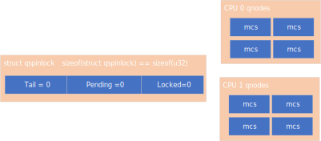
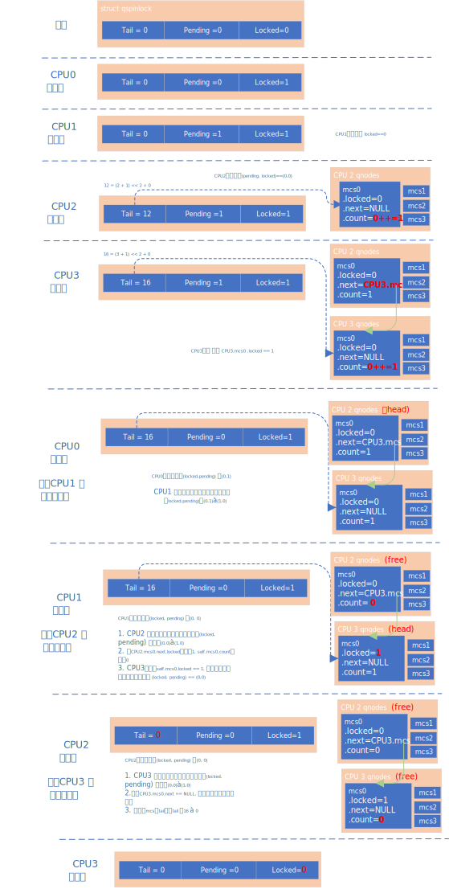

# 简介
内核中的自旋锁是互斥锁。而内核中的自旋锁经过多个版本的演进，
最终是在 mcs 自旋锁 算法之上，根据kernel 本身的需求，作了改进。

我们这里不去回顾 Linux 自旋锁的历史，简单介绍下 mcs 自旋锁算法，
并详细讲解 kernel 中的 mcs自旋锁的变体。

> NOTE
>
> 如果想要了解 kernel 自旋锁的演进，可以看下
>
> [深入理解Linux内核之自旋锁](https://zhuanlan.zhihu.com/p/584016727)
>
> 该文章详细讲解了kernel自旋锁的演进，并通过举例子
> 的方式，讲解了各个算法（包括最新的算法），十分值
> 得看, 本文主要分析kernel 最新的 自旋锁算法。


# MCS 自旋锁
MCS 自旋锁是在为了解决票号自旋锁带来的 cache 抖动的问题<sup>1</sup>, 
实现了一个队列，使其各自自旋各自的地址, 而不是自旋一个地址，这样就
解决了这个问题。

> NOTE 1
> 
> 这里提到的缓存抖动，大家可以设想下，如果每个cpu都在spin 一个地址，
> 当其中一个cpu 去写该地址，则其他的cpu都要去 invalidate 该缓存，并且
> 从内存里重新获取。而且这种动作会一直持续下去。另外，在spin wait loop
> 中，还容易造成 memory order violation， 会进一步影响性能。
>
> 另外大家想下，本身这种设计和MCS 自旋锁的需求是贴合的。
> 因为队列本身具有顺序性，需要前面的线程释放完之后，才能获取到锁，
> 也就是大家只需要关注前面进程何时释放锁即可。

所以 MCS自旋锁 即保持票号自旋锁的保证线程获取锁的顺序的优点，
同时解决票号自旋锁带来的cache 抖动问题。但是也有缺点，我们下面会介绍。

我们先来看下 MCS自旋锁的实现


而MCS自旋锁有什么缺点呢 ?
* 更改了spinlock的相关接口
* 锁占用的内存变大

kernel 对此做了一些优化，我们来看下
# KERNEL MCS 变体

spinlock的相关数据结构(struct qspinlock)，仍然保持之前的样子
大小为`sizeof(u32)`。但是该空间分割成主要的三个成员
`(locked, pending,tail)`。我们来看下kernel代码定义:
```cpp
typedef struct qspinlock {
        union {
                atomic_t val;

                /*
                ¦* By using the whole 2nd least significant byte for the
                ¦* pending bit, we can allow better optimization of the lock
                ¦* acquisition for the pending bit holder.
                ¦*/
#ifdef __LITTLE_ENDIAN
                struct {
                        u8      locked;
                        u8      pending;
                };
                struct {
                        u16     locked_pending;
                        u16     tail;
                };
#else
                struct {
                        u16     tail;
                        u16     locked_pending;
                };
                struct {
                        u8      reserved[2];
                        u8      pending;
                        u8      locked;
                };
#endif
        };
} arch_spinlock_t;
```
可以看到访问该数据结构，应该使用原子操作(qspinlock.val),
根据的线程(cpu)的情况可能需要关注的东西不同, 例如: 
`mcs.locked = 1`的cpu需要关注 (qspinlock.locked_pending)成员。
而pending的cpu仅需要关注(qspinlock.locked), 我们下面会介绍具体的流程



* 简单来说，是占据pending 的cpu抢占locked, 而 占据 mcs head 的cpu
抢占 `locked_pending`, 而非mcs head的cpu, 先抢占 `self.mcs.locked == 1`,
等待该条件满足时，表示其为 mcs head, 然后再抢占 `locked_pending`
* 每个 cpu有四个 mcs0, 代表4中状态（代表4层执行流，线程、软中断、
硬中断、屏蔽中断), 举个例子，线程拿到了锁，这时候来了一个硬
中断，硬中断处理完后，进入软中断处理及流程，这时拿了一把锁，
此时又来了一个硬中断，该中断处理中又拿了一个自旋锁，还未解锁时，
来了一个NMI又拿了一个自旋锁。 这样每个CPU最多持有四把自旋锁。而
每个自旋锁，如果都需要使用 mcs结构 enqueue， 最多需要4个mcs结构。
* tail的计算也是基于上面。每个cpu最多拿四个mcs, 所以tail[bit:1,bit:0]
用来表示当前用了几个自旋锁。cpu index记录在剩余的bits中。另外 
`tail == 0`有特殊的含义 -- 表示没有 mcs 在抢占自旋锁。所以不存在 
`cpu0.mcs0`的这种情况，需要将 `cpu_index++`, 也就是下面的公式:
```
tail = ((cpu_index + 1) << 2) + mcs_index
```

# 代码分析
> NOTE
>
> 下面 频繁使用三元组 (tail, pending, locked) , 例如(0, 0, 1) 表示
> locked = 1, pending = 0, tail = 0
>
> 另外 tail = n , 表示tail位被占用
> 
> tail = z, 则表示tail 为任意值
>
> locked, pending == x, y 表示任意值

我们直接看 `queue_spin_lock()`的相关代码:

## queued_spin_lock
```cpp
static __always_inline void queued_spin_lock(struct qspinlock *lock)
{
        u32 val;
        //=============(1)=================
        val = atomic_cmpxchg_acquire(&lock->val, 0, _Q_LOCKED_VAL);
        if (likely(val == 0))
                return;
        //============(2)==================
        queued_spin_lock_slowpath(lock, val);
}
```
1. 查看`lock->val` 是否为0, 如果为0, 则说明没有人在使用该锁, 将
(0, 0, 0) 修改为 (0, 0, 1)
2. 如果有人占用锁，则走slowpath流程

## slow path
### lock pending -- part 1
```cpp
void queued_spin_lock_slowpath(struct qspinlock *lock, u32 val)
{
        struct mcs_spinlock *prev, *next, *node;
        u32 old, tail;
        int idx;

        BUILD_BUG_ON(CONFIG_NR_CPUS >= (1U << _Q_TAIL_CPU_BITS));
        //===============(1)==================
        if (pv_enabled())
                goto pv_queue;

        if (virt_spin_lock(lock))
                return;

        /*
        ¦* Wait for in-progress pending->locked hand-overs with a bounded
        ¦* number of spins so that we guarantee forward progress.
        ¦*
        ¦* 0,1,0 -> 0,0,1
        ¦*/
        //===============(2)==================
        if (val == _Q_PENDING_VAL) {
                int cnt = _Q_PENDING_LOOPS;
                val = atomic_cond_read_relaxed(&lock->val,
                                        ¦      (VAL != _Q_PENDING_VAL) || !cnt--);
        }

        /*
        ¦* If we observe any contention; queue.
        ¦*/
        //===============(3)==================
        if (val & ~_Q_LOCKED_MASK)
                goto queue;
        /*
    `   ¦* trylock || pending
    `   ¦*
    `   ¦* 0,0,* -> 0,1,* -> 0,0,1 pending, trylock
    `   ¦*/
        //===============(4)==================
    `   val = queued_fetch_set_pending_acquire(lock);
        ...
```
1. 我们这里先不关注半虚拟化
2. 如果是(0, 1, 0)， 则等待其进入(0, 0, 1), 这样做的好处是，如果其进入了
(0,0,1) 则直接抢占pending位，状态为(0,1,1), 就不用走queue的流程
3. 如果除 locked位，其他位不为0, 则说明有被别的线程抢占了，则走queue的流程
4. 该代码为:
```cpp
static __always_inline u32 queued_fetch_set_pending_acquire(struct qspinlock *lock)
{
        return atomic_fetch_or_acquire(_Q_PENDING_VAL, &lock->val);
}
```
这里进行按位或操作，并返回之前的值，我们来想下在原子操作前有那
几种可能的情况。
* (z, 1, y) : 进行逻辑或操作无影响。但是本次抢占锁失败
* (n, 0, y) : !! 这种情况就打乱了顺序，不允许, 并且需要将pending位还原
* (0, 0, 1) : 抢占pending位，spin lock位
* (0, 0, 0) : 抢占了pending位，然后这时，只有自己能抢占lock位，再抢占lock位

我们继续分析(4) 之后的代码:

### lock pending -- part2
```cpp

        /*
        ¦* If we observe contention, there is a concurrent locker.
        ¦*
        ¦* Undo and queue; our setting of PENDING might have made the
        ¦* n,0,0 -> 0,0,0 transition fail and it will now be waiting
        ¦* on @next to become !NULL.
        ¦*/
        //============(1)====================
        if (unlikely(val & ~_Q_LOCKED_MASK)) {

        //============(1.1)====================
                /* Undo PENDING if we set it. */
                if (!(val & _Q_PENDING_MASK))
                        clear_pending(lock);

                goto queue;
        }

        /*
        ¦* We're pending, wait for the owner to go away.
        ¦*
        ¦* 0,1,1 -> 0,1,0
        ¦*
        ¦* this wait loop must be a load-acquire such that we match the
        ¦* store-release that clears the locked bit and create lock
        ¦* sequentiality; this is because not all
        ¦* clear_pending_set_locked() implementations imply full
        ¦* barriers.
        ¦*/
        //===============(2)================
        if (val & _Q_LOCKED_MASK)
                atomic_cond_read_acquire(&lock->val, !(VAL & _Q_LOCKED_MASK));
/*
        ¦* take ownership and clear the pending bit.
        ¦*
        ¦* 0,1,0 -> 0,0,1
        ¦*/
        clear_pending_set_locked(lock);
        lockevent_inc(lock_pending);
        return;
```
1. 除了locked字段以外还有值，则抢锁失败
    + pending字段有值，则为(z, 1, y), 抢锁失败不需要做什么事情, 
    + pending 字段未有值，那tail字段肯定有值，则为(n, 0, y), 抢锁
     失败，还需要将pending位还原为0
    + 以上两种情况都需要入队
2. 这种情况为 (0, 0, y)
    + 如果为 (0, 0, 1), 则spin lock位，等待其变为0
    + 如果位 (0, 0, 0), clear pending 并且 抢占 lock位

### queue -- part1
```cpp
queue:
        lockevent_inc(lock_slowpath);
pv_queue:
        //=================(1)=======================
        node = this_cpu_ptr(&qnodes[0].mcs);
        idx = node->count++;
        tail = encode_tail(smp_processor_id(), idx);

        /*
        ¦* 4 nodes are allocated based on the assumption that there will
        ¦* not be nested NMIs taking spinlocks. That may not be true in
        ¦* some architectures even though the chance of needing more than
        ¦* 4 nodes will still be extremely unlikely. When that happens,
        ¦* we fall back to spinning on the lock directly without using
        ¦* any MCS node. This is not the most elegant solution, but is
        ¦* simple enough.
        ¦*/
        //=================(2)=======================
        if (unlikely(idx >= MAX_NODES)) {
                lockevent_inc(lock_no_node);
                while (!queued_spin_trylock(lock))
                        cpu_relax();
                goto release;
        }

        //=================(3)=======================
        node = grab_mcs_node(node, idx);
```
