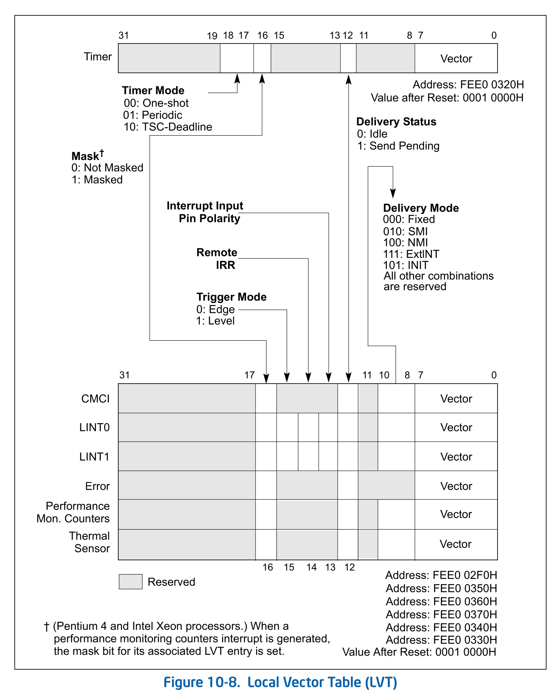
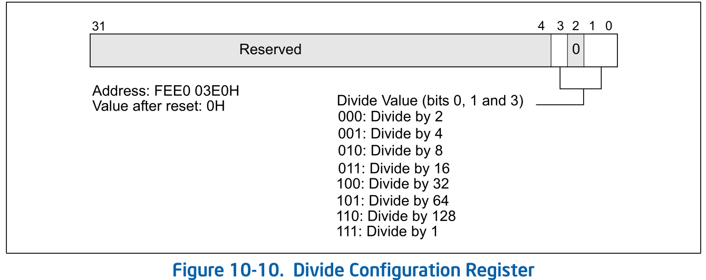

# time

关于time子系统主要分为两个方面:
* 时钟源
* 定时器

该章节主要讨论intel 平台时钟源(主要是tsc) 和定时器(apic timer)的
实现和配置，以及虚拟化。

# TSC
关于此章节主要参考`intel sdm 17.7 Time-Stamp Counter`


## 简介
TSC 是一个高精度的时钟计数器, 该计数器时64 bits counter
该时钟计数会在系统`RESET`时初始化为0，然后在以一个频率自增，
早期的实现，TSC的频率和cpu的频率有关, cpu频率变动, 
tsc的自增频率也变动，所以该时钟源软件用起来不太好用, 
后来intel 实现了`Invariant TSC`,在CPU频率变动，以及CPU
处于不同的电源状态(ACPI P-, C-, T-states), TSC仍然以固定
的频率自增。

我们本章讲解，主要以`Invariant TSC`为主。

## introduction
TSC 机制在 Pentium processor中引入，可以用来monitor/identify
处理器事件发生的相对时间。

TSC architecture 包括如下的组成部分:
* **TSC flag** - 该位指示TSC是否可用。如果`CPUID.1.EDX.TSC[bit 4] = 1`,
 则TSC可用
* **IA32_TIME_STAMP_COUNTER MSR** (被称为TSC MSR, 在P6 family 和 
 Pentium processor中被引入) - 该MSR 用作 counter
* **RDTSC instruction** - 用于读取 time-stamp counter
* **TSD flag** - 是一个control register flags, 用来 enable/disable
 TSC (`CR4.TSD[bit 2] = 1` 时, enable tsc)
```
CR4.TSD
Time Stamp Disable (bit 2 of CR4) — Restricts the execution of the 
RDTSC instruction to procedures running at privilege level 0 when 
set; allows RDTSC instruction to be executed at any privilege level 
when clear. This bit also applies to the RDTSCP instruction if 
supported (if CPUID.80000001H:EDX[27] = 1).
```

上面说到，`Invariant TSC`可以保证 CPU在RESET后，TSC保持一个固定的
ratio, 该ratio可能被设置为处理器 core-clock to bus clock ratio 
的最大值, 也可能被设置为处理器启动时 maximum resolved frequency.
maximum resolved frequency 可能不同于processor base frequency。
在某些处理器上，TSC frequency 可能和 brand string 的 frequency 
不相同。
eg:
```
Intel(R) Core(TM) i5-10210U CPU @ 1.60GHz

[    0.000017] tsc: Detected 2112.005 MHz processor
```
`RDTSC`指令读取 `time-stamp counter` 并且保证每次执行都返回一个
`monotonically increasing unique value`(单调递增的独一无二的
值), 除非是该 64-bit counter 溢出。intel 保证`time-stamp counter`
不会在RESET后10年内溢出。

正常来说, `RDTSC`指令可以运行在任何特权级别，或者运行在`virtual 
8086 mode`。TSD flag 允许该运行在 privilege 0 的`RDTSC`指令被限
制。一个安全的操作系统可能会在系统初始化时设置TSD flags来disable
对于 `privilege level 0`的对TSC的访问。操作系统禁用用户访问tsc后，
应该通过 `user-acessible` 编程接口去模拟该指令。

`RDTSC` 指令不是 `serializing`/`ordered`。在执行读该 counter 之前
去等待所有的先前的指令执行完成。相似的，在`RDTSC`执行前，需要
执行 subsequent instruction。

`RDMSR` 和 `WRMSR` 指令会去read && write TSC, 像是读 ordinary MSR一样

## invariant TSC
新处理器中的time stamp counter 支持了一项增强功能，被称为 `invariant 
TSC`。处理器对 invariant TSC 的支持通过 CPUID.80000007H.EDX[8]。

`invariant TSC`将在所有的ACPI P-, C-, 和T-state中以不变的速率运行。
This is the architectural behavior moving forward. 在支持了
invariant TSC 的处理器上，OS可能使用TSC作为 wall clock timer service
(替代ACPI/HEPT timers)。TSC 的读取效率会更高，不会有ring translation
或者时访问 platform resource 带来的开销

## IA32_TSC_AUX register and RDTSCP support
`IA32_TSC_AUX`是一个辅助性的MSR, `IA32_TSC_AUX`被设计用于结合`IA32_TSC`
使用。`IA32_TSC_AUX`提供了一个32-bit的字段，并由特权级别软件初始化。
（例如可以初始化为 `logical processor ID`)

`IA32_TSC_AUX`早期的用法， 是结合`IA32_TSC` 允许软件通过`RDTSCP`指令atomic
读取`IA32_TSC`中的 time stamp和`IA32_TSC_AUX`中的signal value 。
并且`IA32_TSC`->`EDX:EAX`, `TSC_AUX`->`ECX`。

用户态程序可以使用`RDTSCP`指令判断，是否有CPU migration 的行为。同时也可以
使用它来判断在NUMA系统中`per-CPU TSC`是否会不一致。

## Time-Stamp Counter Adjustment
软件可以通过使用`WRMSR`指令写入`IA32_TIME_STAMP_COUNTER` MSR修改`TSC`的
值。因为每次写入只能操作当前所在的CPU，软件这边来同步这件事情是非常困难的。
（很难让所有CPU 的tsc保持在同一个值）。

`TSC adjustment`的同步机制造是使用`IA32_TSC_ADJUST`MSR。和
`IA32_TIME_STAMP_COUNTER` MSR一样，该寄存器也是每个logical processor
单独存在。逻辑处理器如下使用`IA32_TSC_ADJUST` MSR
* 在RESET时，`IA32_TSC_ADJUST` MSR为0.
* 如果执行`WRMSR`->`IA32_TIME_STAMP_COUNTER` MSR 为原来TSC的值 +/- x,
 处理器也相应的会对`IA32_TSC_ADJUST`MSR, 进行+/- x的操作。
* 如果执行`WRMSR->IA32_TSC_ADJUST` MSR为原来该寄存器值的 +/- x, 
 处理器也相应会对`IA32_TSC_ADJUST` MSR, 进行 +/- x的操作。

`IA32_TSC_ADJUST` 不像`TSC`，不会因为time elapse(时间消逝)而自增，只能通过
`WRMSR`->`IA32_TSC_ADJUST`/`IA32_TIME_STAMP_COUNTER` MSR来改变他的值。
软件可以通过在每个logical processor `WRMSR` 相同的值->`IA32_TSC_ADJUST` MSR,
来保证时间同步。

`CPUID.(EAX=07H, ECX=0H):EBX.TSC_ADJUST(bit 1)` 指示是否支持`IA32_TSC_ADJUST`
MSR。

### 17.17.4 Invariant Time-Keeping
invariant TSC 是基于 `invariant timekeeping hardware`实现，（称为
Always Running Timer or ART), 它以 core crystal clock frequency 
运行。

如果`CPUID.15H:EBX[31:0] != 0` && `CPUID.80000007H:EDX[InvariantTSC] = 1`,
`TSC`和`ART` 保持的线性关系如下：
```
TSC_Value = (ART_Value * CPUID.15H:EBX[31:0] )/ CPUID.15H:EAX[31:0] + K
```
Where 'K' is an offset that can be adjusted by a privileged agent.
> PS: 这里的 K可能指IA32_TSC_ADJUST 和 VMCS 中的 TSC-offset 的值。
When ART hardware is reset, both invariant TSC and K are also reset.

# TSC virtualization
## 简介
从上面`TSC`一章可以看到，intel 为支持`TSC`主要实现了一些MSR(
`IA32_TIME_STAMP_COUNTER`, `IA32_TSC_AUX`, `IA32_TSC_ADJUST`,
和一些指令`RDTSCP`, `RDTSC`, 以及CPUID对上述功能是否支持的
指示。

那么对于`TSC virtualization` 来说，我们不妨先来看看，
和TSC相关的`VMX non-root operation`: `RDTSCP`, `RDTSC`
是怎么个行为。

> PS
>
> RDMSR IA32_TIME_STAMP_COUNTER也会有影响下面会讲到

我们主要来看下, intel sdm `25.3  CHANGES TO INSTRUCTION 
BEHAVIOR IN VMX NON-ROOT OPERATION`, 对于RDTSC和RDTSCP指令的说明:

## RDTSC
Behavior of the RDTSC instruction is determined by 
the settings of the “RDTSC exiting” and “use TSC offsetting” 
VM-execution controls:
* If both controls are 0, RDTSC operates normally.
* If the “RDTSC exiting” VM-execution control is 0 and the 
  "use TSC offsetting” VM-execution control is 1, the 
  value returned is determined by the setting of the "use TSC 
  scaling" VM-execution control:
     + If the control is 0, RDTSC loads EAX:EDX with the sum of
     the value of the IA32_TIME_STAMP_COUNTER MSR and the value
     of the TSC offset.
     + If the control is 1, RDTSC first computes the product of 
     the value of the IA32_TIME_STAMP_COUNTER MSR and the value of
     the TSC multiplier. It then shifts the value of the product
     right 48 bits and loads EAX:EDX with the sum of that shifted
     value and the value of the TSC offset.
* If the "RDTSC exiting" VM-execution control is 1, RDTSC causes 
 a VM exit.

这里面主要提到以下控制位:
* **RDTSC exiting**: 如果控制位为1, `RDTSC`指令则会产生 VM exit。
* **use TSC offsetting** : 用于表示guest和host tsc的差值。
* **use TSC scaling** : 用于表示 guest和host tsc ratio的比例转换。

如果使能`use TSC offsetting`, `use TSC scaling`这两个标志位的话,
我们来看下guest 使用`RDTSC`是什么结果:
* 只使能`use TSC offsetting`: <br/>
  `IA32_TIME_STAMP_COUNTER + TSC offset`
* 使能`use TSC offsetting`和`use TSC scaling`:<br/>
  `(IA32_TIME_STAMP_COUNTER * TSC multiplier) >> 48 + TSC offset`

> NOTE:
>
> 这里为什么要 (IA32_TIME_STAMP_COUNTER * TSC multiplier) >> 48
> 这里其实是想要获取的是guest 和 host TSC ratio的一个转换关系,
> 可能通过这样的方式可以获取更好的精度。
>
> 另外这里要先进行乘法操作，而且由于后面的48 bits的右移，导致如果
> guest ratio 比 host ratio 如果要高的话，考虑到不能溢出，会导致，
> IA32_TIME_STAMP_COUNTER的最大值可能减少很多。(如果是相等的话，
> 实际上少了3/4)。但是不知道这个中间的计算值的类型是不是64bits。
>
> 在手册中没有找到VMX non-root operation下的伪代码，这里涉及的运
> 算关系可能得需要再了解下。

上面讲的`use TSC offsetting`和`use TSC scaling`指的是VM execution
control 字段，关于存储offset和multiplier值的字段如下:
* TSC-offset
* TSC-multiplier

这两个字段
关于`TSC-offset`和`TSC-multiplier`在`intel sdm 24.6.5 Time-Stamp 
Counter Offset and Multiplier` 有讲, 和上面内容类似，不再赘述。

## RDTSCP
Behavior of the RDTSCP instruction is determined first by the
setting of the "enable RDTSCP" VM-execution control:
* If the "enable RDTSCP" VM-execution control is 0, RDTSCP 
causes an invalid-opcode exception (#UD). This exception takes
priority over any other exception the instruction may incur.
* If the “enable RDTSCP” VM-execution control is 1, treatment
 is based on the settings of the “RDTSC exiting” and “use TSC
 offsetting” VM-execution controls:
	+ If both controls are 0, RDTSCP operates normally.
	+ If the “RDTSC exiting” VM-execution control is 0 and the 
	“use TSC offsetting” VM-execution control is 1, the value 
	returned is determined by the setting of the “use TSC scaling”
	VM-execution control:
		* If the control is 0, RDTSCP loads EAX:EDX with the sum of
		the value of the IA32_TIME_STAMP_COUNTER MSR and the value 
		of the TSC offset. Vol. 3C 25-9VMX NON-ROOT OPERATION
		* If the control is 1, RDTSCP first computes the product of
		the value of the IA32_TIME_STAMP_COUNTER MSR and the value 
		of the TSC multiplier. It then shifts the value of the product
		right 48 bits and loads EAX:EDX with the sum of that shifted
		value and the value of the TSC offset.

	In either case, RDTSCP also loads ECX with the value of bits
	31:0 of the IA32_TSC_AUX MSR.
* If the “RDTSC exiting” VM-execution control is 1, RDTSCP 
causes a VM exit.

处理逻辑和`RDTSC`的逻辑大致相同。

## RDMSR IA32_TIME_STAMP_COUNTER
手册中没有没有在`intel sdm 25.3`中解释,但是在`24.6.5 Time-Stamp 
Counter Offset and Multiplier`中有说，`tsc offset`和`tsc multiplier`
会影响到`VMX non-root operation`下`RDMSR  IA32_TIME_STAMP_COUNTER`
的行为。

处理逻辑和`RDTSC`和`RDTSCP`大致相同。

# TIMER
上面主要是讲的时钟，在intel 支持了`invariant TSC`之后，tsc时钟可以
用于`wall clock`。但是软件层面还有另一种需求，就是`timer`。`timer`
可以让软件配置，让其在既定的时间后产生一个`notification`（中断）。
timer的类型有很多，我们这里主要介绍`local apic timer`。(也是精度
最高的)。

## local apic timer
local apic timer 主要包含以下的寄存器:
* divide configuration register
* initial-count register
* current-count register
* LVT timer register

其中还有一个CPUID指示它的工作的行为:
```
CPUID.06H.EAX.ARAT[bit2]
```
* ARAT = 1:  the processor’s APIC timer runs at a constant rate
regardless of P-state transitions and it continues to run at 
the same rate in deep C-states.
* ARAT = 0/ CPUID 06H is not support: <br/>
 the APIC timer may temporarily stop while the processor is in
 deep C-states or during transitions caused by Enhanced Intel
 SpeedStep® Technology.

该CPUID指示`APIC timer`可以在P-state 或者是在deep C-states仍然能够以
不变的频率工作。

APIC timer 可以有几种工作方式:
* one-shot mode
* periodic mode
* TSC-deadline mode

配置apic timer 工作模式:


在用于timer entry的17,18比特，用于指定`timer mode`
<table>
	<th>LVT Bit[18:17]</th>
	<th>Timer Mode</th>
	<tr>
		<td>00b</td>
		<td></td>
	</tr>
	<tr>
		<td>01b</td>
		<td>
			One-shot mode, program count-down value 
			in an initial-count register. See Section 10.5.4
		</td>
	</tr>
	<tr>
		<td>10b</td>
		<td>
			Periodic mode, program interval value in an initial-count
			register. See Section 10.5.4
		</td>
	</tr>
	<tr>
		<td>11b</td>
		<td>
			TSC-Deadline mode, program target value in 
			IA32_TSC_DEADLINE MSR.
		</td>
	</tr>
</table>

### one-shot mode && periodic mode
`one-shot mode`和`periodic mode`都是在`initial-count register`写入
一个既定值，而随后cpu会将该值copy到`current-count register`，
随后，`current-count register` count down。当timer为0的时候，
会触发一个`timer interrupt`。

这个count down是有一个频率的，该频率满足以下公式:
```
(processor bus clock/core crystal clock frequency) / divide configuration register
```


但是在触发timer interrupt后, one-shot mode和periodic mode
行为不太一样。
* **one-shot mode**: 在timer count down 为0 后，timer仍然会
 保持0直到reprogram。
* **periodic mode**: 在timer count down为0后, `current-count
 register`会atomic 从`initial-count register`中reload 其值,
 然后再次count down。如果在count down 的过程中`initial-count 
 register`被设置，会重新count, 使用新的`initial-count` value。

`initial-count register` : rw。<br/>
`current-count register` : ro。


向 `inital-count register`写0, 会stop local APIC timer, 适用于
`one-shot/periodic mode`。

> NOTE
>
> 通过write timer LVT entry 来改变 APIC timer mode (从 one-shot
> ->periodic/vice versa), 不会 start timer。如果要start timer, 
> 需要像前面描述的去写 initial-count register.

### TSC-Deadline Mode
上面说到local-APIC timer 的mode 由LVT Timer Register 中的[18:17]bits
决定, 其中有一种模式叫做`TSC-deadline mode`,该模式还受`CPUID.01H:ECX.
TSC_Deadline[bit 24]`控制。
* 如果 = 0, mode由 register bit 17决定。
* 如果 = 1, mode由 register bit 18:17 决定。

TSC-deadline mode 允许软件使用local apic timer 去signal an interrupt
at an absolute time。在TSC-deadline mode中，对initial-count register
会被忽略; 读取 current-count register 总是0，相对的，使用`IA32_TSC_DEADLINE`
MSR控制 timer behavior。

`IA32_TSC_DEADLINE` MSR是一个per-logical processor MSR，用于指定一个时间，
达到该时间时，会在该processor上产生一个timer interrupt。向`IA32_TSC_DEADLINE`
写入一个64 bit非0值会arms timer。当logical processor's TSC >= `IA32_TSC_DEADLINE`
时，会产生一个interrupt。当timer 生成了一个interrupt, 它将 disarms itself
并且清空`IA32_TSC_DEADLINE` MSR。因此，每次写`IA32_TSC_DEADLINE` MSR会最多
生成一个timer interrupt。

在TSC-deadline mode, 向`IA32_TSC_DEADLINE` MSR写0 会disarm local-APIC timer。
在TSC-deadline mode和其他的timer mode 转换也会 disarms 该timer。

硬件重置 IA32_TSC_DEADLINE值为0。在其他的timer mode中(LVT BIT 18 = 0),
IA32_TSC_DEADLINE MSR 读为0并且写操作被忽略。

软件可以使用下面的算法去配置TSC-deadline timer 来 deliver a single interrupt。
1. 通过核实`CPUID.1:ECX.24 =1`判断支持`TSC-deadline mode`
2. 通过编程LVT timer register 为 10B 选择TSC-deadline mode.
3. 在需要timer interrupt 的 processor 将`IA32_TSC_DEADLINE` MSR 设置为 
target TSC value。这会导致 processor arms timer
4. 当TSC >= IA32_TSC_DEADLINE 时，处理器产生一个timer interrupt。
然后disarms timer并且清空IA32_TSC_DEADLINE MSR。（TSC和IA32_TSC_DEADLINE
MSR都是64-bit unsigned integers)
5. 软件可以 通过步骤 3 re-arm timer

以下是 TSC-deadline 模式的使用指南(guideline)：
* 向IA32_TSC_DEADLINE MSR执行写入操作是不被序列化的。因此，系统软件不应该将
 `WRMSR IA32_TSC_DEADLINE`作为主 serializing instruction。对 IA32_TSC_DEADLINE
 和其他MSR register的读, 写访问将按照程序顺序执行。
* 软件可以在任何时间通过向IA32_TSC_DEADLINE MSR 写0来 disarm timer。
* 如果timer 被 armed, 软件可以通过 向`IA32_TSC_DEADLINE` MSR写入新值来
改变 deadline (forward or backward)
* 如果软件 disarms timer 或者 postpone(延期) deadline, race conditions 可能
 导致 delivery a spurious(虚假的) timer interrupt。软件应通过检查当前
 TSC的值来确认该中断是否是需要的从而判断该中断是不是 spurious interrupt。
* 在xAPIC mode中（在此模式中 local-APIC register 是 memory-mapped), 软件
 应该 order 向 LVT entry 执行memory-mapped  write(使能TSC-deadline mode)和
 之后任何WRMSR to IA32_TSC_DEADLINE MSR。软件应该在 memory-mapped write 后
 和 any WRMSR 之前，通过执行`MFENCE`指令来确保正确的顺序。(在 x2APIC mode，
 WRMSR instruction 被用来写 LVT entry。处理器保证此次write 和之后的任意
 WRMSR to deadline顺序; 不需要 fencing)

## VMX-Preemption Timer
该timer是给 VMX non-root operation 下用的. intel sdm中有三个地方讲解了

如果设置了`active VMX-preemption timer`为1, `VMX-preemption timer` 就会在VMX
non-root operation 中 count down(VM entry 时会load (详见intel sdm 26.7.4 ))。
当timer count down 到 0, cpu将stop count down ,并且 产生一个 VM exit。

> NOTE
>
> 可以看到该timer并不会让其在VMX non-root operation 下避免产生VM exit，所以
> 感觉这个功能对性能提升不明显。但是官方对此进行了回答
>
> [Why are we using preemption timer on x86?](https://www.spinics.net/lists/kvm/msg193150.html)
>
> 大概的意思是，引入该功能可以避免使用 复杂的 OS's hrtimer system,
> 并且避免了引host timer interrupt  handling cost，而该功能会有
> a little math(不知道是不是可以翻译为转换)  (对于 guest->host TSC &&
> host TSC -> preemption timer conversion) 和 a cheaper VM exit。
> 并且更有利于 isolated pCPUs（独占的 vcpu ?)

VMX-preemption timer 以 TSC 成比例的rate count down。明确的说，
该timer count down 1 , TSC increment X。X 的范围是 [0,31]
并且可以通过 VMX capability MSR `IA32_VMX_MISC`指定。

VMX-preemption timer 运行在 c-states C0, C1, C2; 它也可以运行
在 shutdown/ wait-for-SIPI state。如果timer 在除 wait-for-SIPI state
的其他的任意状态下 count down 到0, logical processor 会转换到C0 C-state
并且产生一个 VM exit。如果timer 在wait-for-SIPI state 中count down to 0,
将不会产生vm-exit。timer 也不会在 deeper than C2 的C-state 下 decrement。

# 

# PS
## CPUID 15H
> NOTES:
>
> If EBX[31:0] is 0, the TSC/”core crystal clock” ratio is not enumerated.
>
> EBX[31:0]/EAX[31:0] indicates the ratio of the TSC frequency and the core crystal clock frequency.
>
> If ECX is 0, the nominal core crystal clock frequency is not enumerated.
>
> “TSC frequency” = “core crystal clock frequency” * EBX/EAX.
>
> The core crystal clock may differ from the reference clock, bus clock, or core clock frequencies.
>
> nominal frequency 频率标准值   (nominal 名义上的)
> 
> crystal: 晶体, core crystal clock frequency : 晶振提供的核心频率
>
> 关于频率相关知识见: 
> 
> [perf中cycles，ref-cycles与bus-cycles的调查研究](https://zhuanlan.zhihu.com/p/474082387)
>
> 上面一段话的意思:
> 如果 EBX[31:0] 为0, 则 TSC/"core crystal clock" ratio 没有再此列出来
>  EBX[31:0]/EAX[31:0] : 指示 tsc frequency 和 core crystal clock frequency 之间的 ratio, 
>> 这个 ratio是基于core crystal clock frequency 上面的连接中提到过，该频率和TSC
>> 之前有一个倍率(因为晶振提供的频率不高，需要在 CPU 侧进行频率的倍增。所以其中间
>> 存在着一个倍率关系
>
> 如果ECX为0, nominal core crystal clock frequency 再此不列出。
>
> core crystal clock 可能和 reference clock ,bus clock, 以及 core clock
> frequency 不同
>> 关于上面提到的几个clock频率, 在 [intel perfmon events](https://perfmon-events.intel.com/)
>> 链接中有提到，不同微架构事件可能不同

* EAX Bits 31-00: An unsigned integer which is the denominator of the TSC/”core crystal clock” ratio.
* EBX Bits 31-00: An unsigned integer which is the numerator of the TSC/”core crystal clock” ratio.
* ECX Bits 31-00: An unsigned integer which is the nominal frequency of the core crystal clock in Hz.
* EDX Bits 31-00: Reserved = 0.

所以, tsc 频率的算法是:
```
CPUID.15:ECX * (CPUID.15:EBX / CPUID.15:EAX)
```
